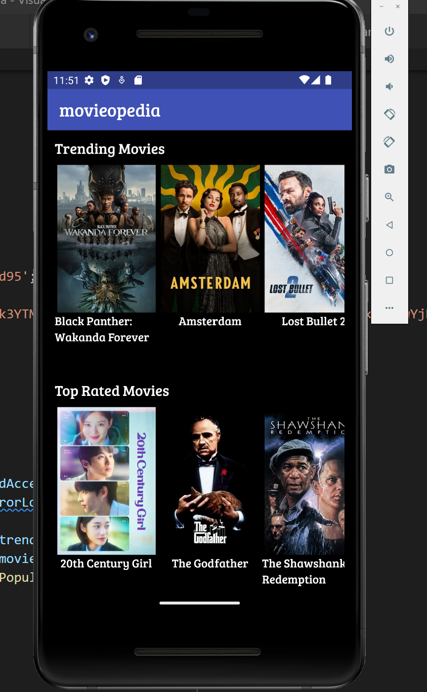
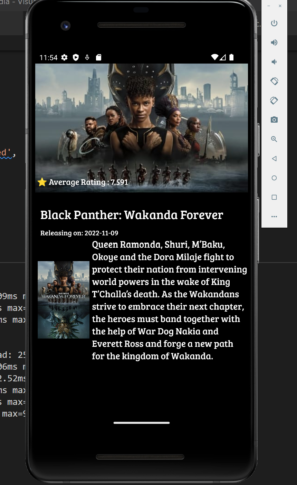
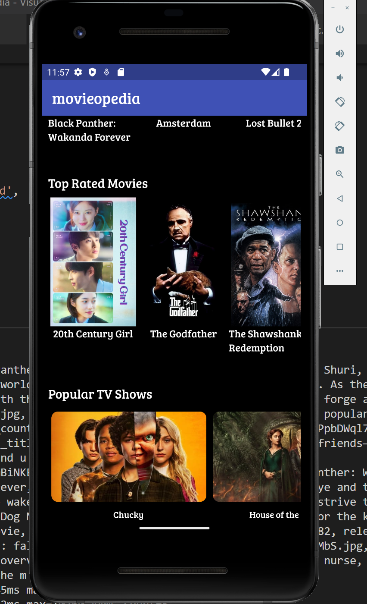

# movieopedia

    Flutter app to view details of current trending, top-rated and popular tv shows.
    Three widgets in the project are:
    1. Trending Movies
    2. Top Rated Movies
    3. Popular TV shows

  <b>First Widget and Screen:</b>

  <b>Second Widget and Screen:</b>

  <b>Third Widget:</b>

